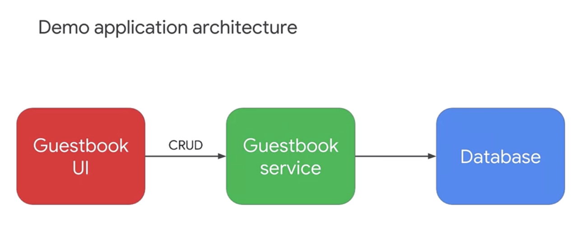

# Building Scalable Java Microservices with Spring Boot

## Demo Applicaiton Structure

The front end application provides a simple web form that allows a user to post the message, composed of a user name and a message body. When a message is submitted by the user, the front end application sends it to the back end service. The back end service then creates a new record to store the message. The front end also displays a list of previous messages, retrieved from the back end service.

The demo application follows a classic three tier web architecture. The front end application sends messages to the back end services, to create, retrieve, update, and delete records. The single back end service in the demo, sends responses back to the front end, and uses a database service for storage of the message content. The application is initially configured to use an embedded HSQL database. Persistent database storage can be implemented using MySQL, or a similar database service, to replace the embedded HSQL database. In the first lab you will using Spring Boot to configure the application. To use the cloud SQL instance for the database functions, that it needs to store and retrieve structured data.

### TO DO:

Application needs to use Cloud SQL for it's database 

# JAVAMS01 Bootstrapping the Application Frontend and Backend

> Going cloud native is not only about replicating the architectures that you have to implement in your own data center, simply substituting virtual machine-based workloads for bare-metal workloads. Cloud-native applications can adopt the fully managed cloud services and platforms that require little or no manual operational overhead."

|Services| On-premise | GCP Cloud|
|---|---|---|
| RDBMS | MySQL | Cloud SQL 
| messaging pipeline | RabbitMQ | Cloud Pub/Sub
| distributed trace stores | Zipkin | Stackdriver Trace
| centralized configuration services | Spring Config | Cloud Runtime Configuration API

